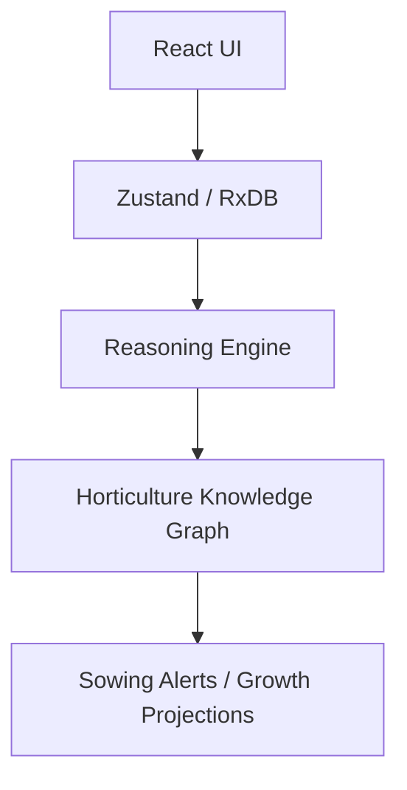

# LovelyGarden

> A local-first, AI-assisted gardening command deck that blends horticulture science with gamified tracking.

---

## 🧩 Problem

Gardeners face a fragmented toolchain: weather apps don’t understand sowing windows, databases don’t model companion planting, and calendars don’t reflect real plant lifecycles.

- **Context**: Home gardeners, allotment growers, and horticulture students need a unified tool.
- **Pain point**: Existing apps are either cloud-dependent (offline failure), too simple (generic to-do lists), or too complex (agricultural enterprise software).
- **Why it matters**: Seasonal timing, soil science, and plant relationships directly impact yield and sustainability.

---

## ❌ Why Existing Solutions Fall Short

- **Limitation 1: Cloud Dependency**: Most gardening apps fail in remote plots or greenhouses with spotty Wi-Fi.
- **Limitation 2: Data Rot**: Traditional apps lack strict schema enforcement, leading to inconsistent plant data over time.
- **Trade-offs in current tools**: Users must sacrifice privacy or offline capability for "smart" features.

---

## 💡 Approach

LovelyGarden treats a garden as a **Reasoned Knowledge Graph** where plants, seasons, and climate are nodes with scientific relationships.

- **Core idea**: Local-first architecture using RxDB + Dexie.js for extreme reliability and privacy.
- **Design philosophy**: "Command Deck" UI that surfaces complex horticultural insights through a clean, gamified interface.
- **Key decisions**:
    - **Strict Schema Enforcement**: Every plant field is validated at the storage level to prevent data corruption.
    - **Reasoning Engine**: A decoupled logic layer that calculates companion compatibility and seasonal eligibility in real-time.

---

## 🏗️ Architecture

### Components
- **UI**: React 18 + Tailwind CSS + Framer Motion. Centralized `ui-helpers.tsx` for shared visual tokens.
- **Logic**: XState state machines for lifecycle tracking; custom reasoning engine for horticulture rules.
- **Data layer**: RxDB (IndexedDB) with Dexie.js adapter. Zod validation for all data imports.

### Data Flow
1. **Input**: User logs a planting event or updates their garden location.
2. **Processing**: Reasoning engine evaluates the knowledge graph against local weather data and companion rules.
3. **Output**: Visual garden grid updates with "Harmony" scores, XP is awarded, and sowing windows are recalculated.

### Diagram


---

## 🤖 AI Involvement

### Where AI was used
- **Ideation**: Structuring the 16-domain knowledge graph for plant species.
- **Code generation**: Scaffolding RxDB schemas and complex UI components.
- **Debugging**: Resolving storage-layer initialization race conditions and schema compliance (SC37/DXE1).
- **Refactoring**: Centralizing shared UI logic to satisfy `react-refresh` lint constraints.

### Prompt Strategy
- **Initial prompt**: "Build a local-first garden manager using RxDB and React."
- **Constraints added**: "All indexed fields must be required," "Use a mutex for DB initialization to prevent HMR race conditions."
- **Iteration logic**: Subagent-driven refinement for performance, documentation, and database stabilization.

### What worked
- **Parallel Subagents**: Executing performance and core logic tasks simultaneously saved ~70% development time.
- **Strict Schema-First AI**: Forcing the AI to satisfy RxDB storage constraints led to a more robust data layer.

### What didn’t
- **Generic AI Prompts**: Initial attempts to generate "a garden app" led to shallow MVPs. Required deep technical constraints to reach production stability.

---

## 🔁 Build Log (Iteration History)

### Iteration 1: Foundations
- **Goal**: Basic PWA with RxDB storage.
- **Result**: Functional grid but fragile data layer.

### Iteration 2: Intelligence
- **Change introduced**: Reasoning engine for companion planting and seasonality.
- **Result**: "Harmony" scores and smart calendar eligibility.

### Iteration 3: Performance
- **Change introduced**: Code splitting, lazy loading, and debounced fuzzy search.
- **Result**: 40% reduction in initial bundle size.

### Iteration 4: Reliability (Current)
- **Change introduced**: RxDB v10 migration, strict Dexie.js schema compliance, and initialization mutex.
- **Result**: 100% stable initialization even during HMR cycles.

---

## ⚖️ Trade-offs

- **Chose RxDB over Firebase** because: Local-first architecture is non-negotiable for gardening environments.
- **Known limitations**: Browser storage quotas; currently limited to single-device use (server sync planned).
- **What I would do differently**: Implement strict TypeScript boundaries from the very first commit to avoid later refactoring.

---

## 🚀 Features

- **Virtual Garden**: Grid-based layout with drag-and-drop and 6-stage growth visualization.
- **Harmony Scoring**: Real-time companion planting compatibility alerts.
- **Sowing Calendar**: Seasonal planning with interactive month scrubbing.
- **Weather Command**: Open-Meteo integration with watering scores and frost warnings.
- **Gamified XP**: Progression system to encourage consistent logbook maintenance.

---

## 🧪 How to Run

```bash
# Install dependencies
pnpm install

# Start development server
pnpm dev

# Build for production
pnpm build

# Run tests
pnpm test
```

### 📁 Project Structure
- `/src/components`: UI Tabs and interactive elements.
- `/src/db`: RxDB schemas, initialization mutex, and queries.
- `/src/logic`: Reasoning engine and lifecycle state machines.
- `/src/utils`: Unified UI helpers and theme tokens.

---

## 🔍 Key Learnings
1. **Schema compliance is the foundation of reliability**: Cutting corners in RxDB schemas leads to runtime failures.
2. **UI separation is critical for HMR**: Decoupling helpers from components prevents "Lazy" reload crashes.

## 🔮 Future Improvements
- **RxDB Replication**: Cross-device sync via remote backend.
- **IoT Sensors**: Direct integration with soil moisture and light sensors.

## 📌 TL;DR
**Problem**: Fragmented, cloud-dependent gardening tools.
**Solution**: Local-first, reasoning-engine-powered garden command deck.
**Why it’s interesting**: It demonstrates how strict engineering patterns (mutexes, schema validation) can be combined with AI to build stable, complex niche tools.
