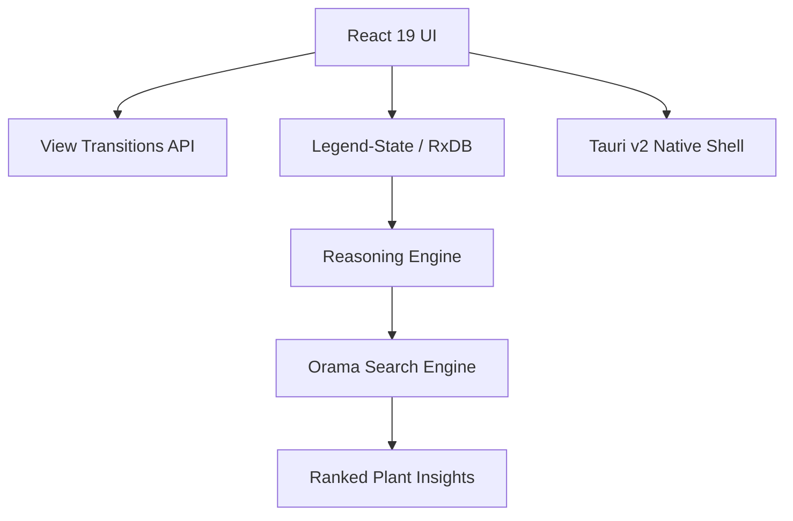

# LovelyGarden

> A local-first, AI-assisted gardening command deck that blends horticulture science with gamified tracking.

---

## 🧩 Problem

Gardeners face a fragmented toolchain: weather apps don’t understand sowing windows, databases don’t model companion planting, and calendars don’t reflect real plant lifecycles.

- **Context**: Home gardeners, allotment growers, and horticulture students need a unified tool.
- **Pain point**: Existing apps are either cloud-dependent (offline failure), too simple (generic to-do lists), or too complex (agricultural enterprise software).
- **Why it matters**: Seasonal timing, soil science, and plant relationships directly impact yield and sustainability.

---

## ❌ Why Existing Solutions Fall Short

- **Limitation 1: Cloud Dependency**: Most gardening apps fail in remote plots or greenhouses with spotty Wi-Fi.
- **Limitation 2: Data Rot**: Traditional apps lack strict schema enforcement, leading to inconsistent plant data over time.
- **Trade-offs in current tools**: Users must sacrifice privacy or offline capability for "smart" features.

---

## 💡 Approach

LovelyGarden treats a garden as a **Reasoned Knowledge Graph** where plants, seasons, and climate are nodes with scientific relationships.

- **Core idea**: Local-first architecture using RxDB + Dexie.js for extreme reliability and privacy.
- **Design philosophy**: "Command Deck" UI that surfaces complex horticultural insights through a clean, gamified interface.
- **Key decisions**:
  - **Strict Schema Enforcement**: Every plant field is validated at the storage level to prevent data corruption.
  - **Reasoning Engine**: A decoupled logic layer that calculates companion compatibility and seasonal eligibility in real-time.

---

## 🏗️ Architecture

### Components

- **UI**: React 19 + Tailwind CSS + Motion. Native View Transitions API for seamless navigation.
- **Logic**: XState state machines for lifecycle tracking; custom reasoning engine for horticulture rules.
- **Intelligence**: Orama vector-ready search engine for sub-millisecond plant knowledgebase indexing.
- **Data layer**: RxDB (IndexedDB) with Dexie.js adapter. Local-first persistence.
- **Desktop**: Tauri v2 (Rust backend) for native shell integration and premium desktop features.

### Data Flow

1. **Input**: User logs a planting event or searches the knowledgebase.
2. **Processing**: Orama indexes rank results by horticultural relevance; reasoning engine evaluates the knowledge graph.
3. **Output**: Native system notifications (Tauri), hardware-accelerated UI transitions, and updated garden grid state.

### Diagram



---

## 🤖 AI Involvement

### Where AI was used

- **Modernization**: Migrating the stack to React 19 and implementing the Native View Transitions API.
- **Search Engineering**: Swapping legacy Fuse.js for Orama, implementing a custom indexing module with typings.
- **Native Integration**: Scaffolding the Tauri v2 Rust backend and manual plugin registration for notifications and OS info.
- **Architecture Refactoring**: Identifying and rejecting over-engineered patterns (like Effect-TS) in favor of pragmatic, high-performance logic.

### Prompt Strategy

- **Chain of Thought**: Using sequential thinking to evaluate library trade-offs (e.g., Orama vs Fuse.js) before implementation.
- **Phase-Based Execution**: Breaking the modernization into 4 distinct sprints (Core, Performance, Intelligence, Packaging).
- **Skeptical Pre-Flight**: Forcing the AI to verify dependencies and linker paths before making broad destructive changes.

### What worked

- **Local-First Search**: Orama's performance in the browser exceeded expectations for fuzzy-search relevance.
- **Native Compositor Animations**: Moving from JS-based AnimatePresence to native View Transitions reduced main-thread load during navigation.

---

## 🔁 Build Log (Iteration History)

### Iteration 1-4: Foundation & Reliability

- **Goal**: Stable RxDB persistence and core PWA features.
- **Result**: Production-ready local-first baseline.

### Iteration 5: Core Modernization (Phase 1)

- **Change**: Upgraded to React 19, migrated to `motion` package, and resolved peer-dep conflicts.
- **Result**: Future-proof runtime with zero legacy React warnings.

### Iteration 6: Performance & UX (Phase 2)

- **Change**: Implemented native View Transitions API and installed Legend-State for fine-grained reactivity.
- **Result**: Fluid, "app-like" transitions with hardware acceleration.

### Iteration 7: Intelligence (Phase 3)

- **Change**: Integrated Orama search module to replace Fuse.js.
- **Result**: Significantly better search relevance and ranking for the plant knowledgebase.

### Iteration 8: Premium Packaging (Phase 4)

- **Change**: Initialized Tauri v2, configured native notifications, and modernized the launcher.
- **Result**: Ready for native desktop distribution with system-level integration.

---

## 🚀 Features

- **Native Search**: Orama-powered plant knowledgebase with ranked horticultural results.
- **Fluid Navigation**: Compositor-level View Transitions for tab switching.
- **Virtual Garden**: Grid-based layout with 6-stage growth visualization.
- **Harmony Scoring**: Real-time companion planting compatibility alerts.
- **Weather Command**: Open-Meteo integration with watering scores and frost warnings.
- **Native Notifications**: Desktop system alerts for garden events (via Tauri).

---

## 🧪 How to Run

```bash
# Install dependencies
pnpm install

# Start development server (Web/PWA)
pnpm dev

# Start development mode (Native Desktop)
pnpm tauri dev

# Run unit tests
pnpm test:unit

# Run smoke test (Chromium)
pnpm test:smoke

# Run full E2E suite
pnpm test:e2e

# Run full diagnostics bundle (logs + build + tests)
pnpm test:diagnostics

# Build for Native Production
pnpm tauri build
```

> [!IMPORTANT]
> To build the native desktop app (`pnpm tauri build`), you must have the **Visual Studio C++ Build Tools (MSVC)** installed on your system.

`pnpm test:diagnostics` stores timestamped logs in `artifacts/diagnostics/<run-id>/` for deep debugging.

---

### 📁 Project Structure

- `/src-tauri`: Native Rust backend and Tauri configuration.
- `/src/lib`: Core modules like Orama search (`plantSearch.ts`).
- `/src/utils`: Unified UI helpers and native API wrappers (`native.ts`).
- `/sprint`: Detailed logs of the modernization phases.

---

## 🔍 Key Learnings

1. **Native APIs are often superior to libraries**: Moving from Framer Motion's AnimatePresence to native View Transitions improved performance and reduced complexity.
2. **Local search is the killer feature for offline-first**: Orama provides "server-side" quality search without ever leaving the user's device.

---

## 📌 TL;DR

- **Problem**: Cloud-dependent, slow gardening tools.
- **Solution**: React 19 + Tauri v2 powered local-first command deck with Orama intelligence.
- **Why it’s interesting**: Shows the evolution of an AI-assisted project from a simple PWA to a high-end, native desktop application using state-of-the-art web APIs.
