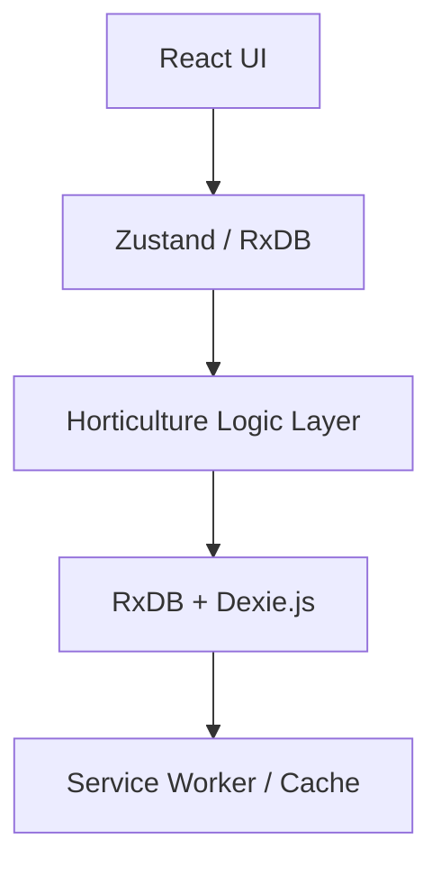

# Architecture - LovelyGarden

## High-Level Design

LovelyGarden follows a **modular, local-first architecture** designed for high reliability in gardening environments. It separates the presentation layer from the horticultural reasoning engine and the strict storage layer.

---

## System Diagram

---

## Component Breakdown

### UI Layer (`src/components/`, `src/utils/`)

| Component               | Responsibility                                                                                          |
| ----------------------- | ------------------------------------------------------------------------------------------------------- |
| `VirtualGardenTab`      | Grid-based garden with DnD and harmony scoring.                                                         |
| `SowingCalendarTab`     | Seasonal planning with scientific eligibility filtering.                                                |
| `PlantKnowledgebaseTab` | Extensive species catalog with fuzzy search.                                                            |
| `ui-helpers.tsx`        | **Centralized** visual tokens (colors, icons) to ensure HMR stability and satisfy `react-refresh` lint. |
| `PlantedCard`           | Individual plant card with lifecycle stages.                                                            |
| `LogbookTab`            | Activity logging (CRUD).                                                                                |

### Logic Layer (`src/logic/`)

| Module              | Responsibility                                                                       |
| ------------------- | ------------------------------------------------------------------------------------ |
| `lifecycle.ts`      | XState finite state machines for plant growth stages (seed → germination → harvest). |
| `reasoning.ts`      | Companion planting rules, antagonist scoring, and seasonal windows.                  |
| `diagnostics.ts`    | Automated plant health and harmony analysis.                                         |
| `explainability.ts` | User-facing decision explanations (why a plant is/isn't eligible).                   |

### Data Layer (`src/db/`)

| File               | Responsibility                                                                                                 |
| ------------------ | -------------------------------------------------------------------------------------------------------------- |
| `schemas.ts`       | **RxDB v10 Schemas**: Strict compliance with `required` and `maxLength` constraints for indexed fields.        |
| `index.ts`         | **DB Mutex**: Prevents initialization race conditions during React Strict Mode/HMR using a global `dbPromise`. |
| `queries.ts`       | Optimized database operations with secondary indexing.                                                         |
| `export-import.ts` | JSON backup/restore with Zod validation.                                                                       |

---

## Data Flow Examples

### 1. Planting a Seed

1. User drags seed from `SeedStore` → `GardenGrid`.
2. `usePlantedCards` hook calls `db.planted.insert()`.
3. XState machine initializes → `seed` state.
4. `VirtualGardenTab` re-renders grid with new plant.
5. Care events update plant state and are recorded in the logbook.

### 2. Fuzzy Searching the Catalog

1. User types in `PlantKnowledgebaseTab` search input.
2. `debounce.ts` waits 300ms to prevent excessive filtering.
3. `fuse.js` performs fuzzy search on the merged plant catalog.
4. Virtualized list re-renders with matched results.

---

## Key Design Decisions

### 1. RxDB v10 Migration

**Decision**: Upgrade to RxDB v10 and enforce strict schema attributes (`maxLength`, `multipleOf`).
**Reason**: Dexie.js requires explicit constraints on indexed fields to prevent initialization failures (SC37, DXE1).

### 2. Initialization Mutex

**Decision**: Implement a global `dbPromise` mutex in `db/index.ts`.
**Reason**: Prevents double-initialization crashes during Vite HMR or React Concurrent rendering cycles.

### 3. UI Helper Centralization

**Decision**: Move non-component logic (icons, color mappers) to `src/utils/ui-helpers.tsx`.
**Reason**: Fixes `react-refresh` lint warnings and prevents "Lazy" component crashes during hot reloads.

---

## Technology Choices

| Technology       | Why?                                                        |
| ---------------- | ----------------------------------------------------------- |
| **Vite 5**       | Fast HMR, PWA plugin, Rollup bundling.                      |
| **RxDB**         | Local-first architecture, MongoDB-like queries, sync-ready. |
| **XState v5**    | Deterministic state transitions for plant growth.           |
| **Tailwind CSS** | Rapid theming and consistent design tokens.                 |
| **Zod**          | Runtime validation for imports and API responses.           |
| **@dnd-kit**     | Accessible drag-and-drop for the garden grid.               |

---

## Performance Optimizations

- **Vendor Splitting**: Large libraries (RxDB, Lucide, Recharts) are bundled into separate chunks for better caching.
- **Strict Indexing**: All primary queries use indexed fields (`bedId`, `catalogId`) for sub-millisecond lookups.
- **Lazy Hydration**: Components like `GrowthGraph` are only loaded when the inspector is opened via `React.lazy`.
- **WebP Assets**: Assets like `garden-bg.png` are converted to WebP for faster mobile loading.

---

## Testing Strategy

- **Unit Tests**: Vitest coverage for the reasoning engine and state machine transitions (26+ tests).
- **E2E Tests**: Playwright scripts for critical workflows (seed purchase, settings customization).
- **Schema Validation**: Automated AJV validation during development to catch schema violations immediately.
- **Build Quality**: 0 errors in TypeScript strict mode.
